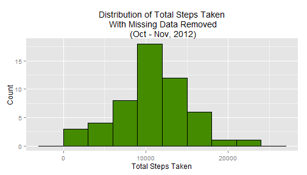
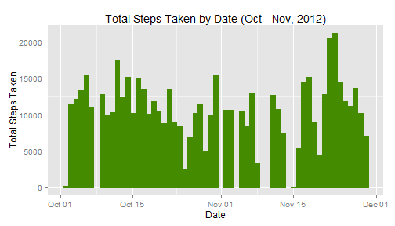
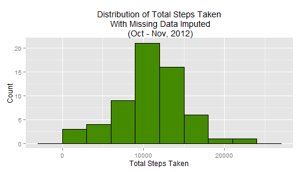
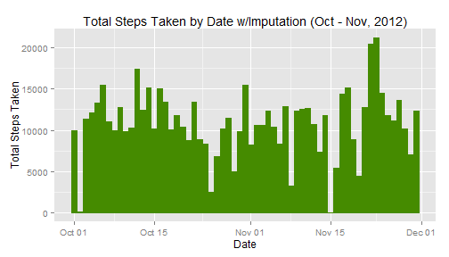
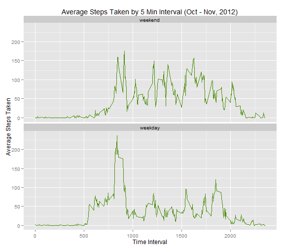

# Reproducible Research: Peer Assessment 1
Submitted by Christopher Bortz
For Reproducible Research, Section 6 - Dr. Rodger Peng
September 1 - 29, 2014

This assignment involves analyzing data from an activity monitoring device where data was collected during October and November of 2012. The dataset, activity.zip, was already supplied in the Github repository from which this repository was forked.

## Loading and preprocessing the data
The first task is to unzip the repository and get the activity.csv file which contains 17,568 rows with steps, a date in YYYY-MM-DD format, and an interval number which is really just the hour and minute encoded as an integer number.

I decided to use the data.table library for quick loading of the data, the lubridate library for date conversions, the plyr library for manipulating the data and the ggplot2 library for all plots.

```r
library(data.table)  #data.tables are SO much faster than data frames
library(lubridate) # Very handy date conversion functions
library(plyr) # Good for split-apply-combine processes
library(ggplot2) # My favorite default plotting library
```

Now we need to unzip the archive, read in the data using ```fread()```, and then convert the date column into a POSIXct formatted date.

```r
if(file.exists("./activity.zip") & !file.exists("./activity.csv")) {
    unzip("./activity.zip")
}
activity <- fread("./activity.csv")
activity$date <- ymd(activity$date) #Now we have POSIXct class dates
```
This dataset has a total of 17,568 rows.

## What is mean total number of steps taken per day?
The assignment calls for a histogram to show the distribution of the total number of steps per day. I created that histogram but also created a bar chart to show by day the total number of steps taken so I could see how the missing data affects those totals.

The histogram required that I remove any missing data and the bar chart uses the data as is.


```r
# This will be for the histogram
stepsPerDayNoNa <- ddply(na.omit(activity), "date", summarize,
                         totalSteps = sum(steps))

# This will be for the bar chart (not required but nice)
stepsPerDay <- ddply(activity, "date", summarize,
                     totalSteps = sum(steps))
```

Here is the histogram showing the distribution of total Steps with missing data removed.

```r
ggplot(data = stepsPerDayNoNa,
       aes(x = totalSteps)) + 
    geom_histogram(fill = "chartreuse4", colour = "black", binwidth = 3000) +
    xlab("Total Steps Taken") +
    ylab("Count") + 
    ggtitle(paste("Distribution of Total Steps Taken\n", 
            "With Missing Data Removed\n", 
            "(Oct - Nov, 2012)"))
```

 

Here is a plot of the total number of steps per day without missing values removed.

```r
ggplot(data = stepsPerDay,
       aes(x = date,
           y = totalSteps)) + 
    geom_bar(stat = "identity", colour = "chartreuse4", fill = "chartreuse4") + 
    xlab("Date") + 
    ylab("Total Steps Taken") + 
    ggtitle("Total Steps Taken by Date (Oct - Nov, 2012)")
```

 

From this data, a mean and median was calculated over the total steps per day for the two month period that the data was collected, again with missing values simply removed.

```r
meanSteps = mean(stepsPerDay$totalSteps, na.rm = TRUE)
medianSteps = median(stepsPerDay$totalSteps, na.rm = TRUE)
```
The mean number of steps was 10,766, and the median was 10,765.

## What is the average daily activity pattern?
We can also analyze the data according to five minute time interval.

```r
stepsPerInterval <- ddply(activity, "interval", summarize,
                          meanSteps = mean(steps, na.rm = TRUE))
```

When we look at the average activity according to the time interval it occurred in we get this picture:

```r
ggplot(data = stepsPerInterval,
       aes(x = interval,
           y = meanSteps)) + 
    geom_line(colour = "chartreuse4") + 
    xlab("Time Interval") + 
    ylab("Average Steps Taken") + 
    ggtitle("Average Steps Taken by 5 Min Interval (Oct - Nov, 2012)")
```

 

When we calculate the most active interval

```r
mostActiveInterval <- stepsPerInterval[which.max(stepsPerInterval$meanSteps), ]
```
We find that the highest average number of steps (206.1698) occurred during interval 835, which corresponds to 8:35 AM.

## Imputing missing values
This activity data, as most data, had quite a few missing values

```r
missingValues = sum(!complete.cases(activity$steps))
```
There were 2,304 to be exact. And some entire days have no values for steps taken. So imputing values required some thought. I decided that I would take the mean number of steps for that time interval and day of the week and use that to impute the missing values into the activity data.

```r
# Step 12 - We need a couple of convenience functions, one will calculate
#           whether a date falls on the weekend and the other will 
#           impute missing data with the average for the activity
#           of that interval and day.

# Takes a date in POSIXct format and returns a logical whether this date falls on the weekend
weekend <- function(x) {
    return(wday(x) %in% c(1,7)) # Is this day either Saturday (7) or Sunday (1)?
}
dayType <- function(x) {
    if(weekend(x)) {
        return("weekend")
    } else {
        return("weekday")
    }
}

# If the value is missing it will take the mean of similarly grouped values
# This sweet function comes from:
# http://stackoverflow.com/questions/9322773/how-to-replace-na-with-mean-by-subset-in-r-impute-with-plyr
# which comes from Hadley Wickam at:
# http://www.mail-archive.com/r-help@r-project.org/msg58289.html
impute.mean <- function(x) {
    return(replace(x, is.na(x), mean(x, na.rm = TRUE)))
}

# Step 13 - Impute missing values and add factor
# If the number of steps is NA, then impute the missing value by
# taking the mean over the other values of that interval for that day of the week
activityImputed <- ddply(activity, 
                         ~ interval + wday(date),
                         transform,
                         steps = impute.mean(steps),  # Impute missing values
                         dayType = dayType(date))  # Create factor weegend/weekday
# ddply reorders according to grouping so we need to restore the original order
activityImputed <- arrange(activityImputed, date, interval) 
```
After creating my new data set with imputed values, I reran my summary.

```r
stepsPerDayImputed <- ddply(activityImputed, "date", summarize,
                            totalSteps = sum(steps))
```

Here is a distribution of total steps (histogram) with imputed values:

```r
ggplot(data = stepsPerDayImputed,
       aes(x = totalSteps)) + 
    geom_histogram(fill = "chartreuse4", colour = "black", binwidth = 3000) +
    xlab("Total Steps Taken") +
    ylab("Count") + 
    ggtitle(paste("Distribution of Total Steps Taken\n", 
                  "With Missing Data Imputed\n", 
                  "(Oct - Nov, 2012)"))
```

 


And here is a bar chart also with imputed values:

```r
ggplot(data = stepsPerDayImputed,
       aes(x = date,
           y = totalSteps)) + 
    geom_bar(stat = "identity", colour = "chartreuse4", fill = "chartreuse4") + 
    xlab("Date") + 
    ylab("Total Steps Taken") + 
    ggtitle("Total Steps Taken by Date w/Imputation (Oct - Nov, 2012)")
```

 

Now I compare the means and medians between the two sets

```r
meanStepsImputed = mean(stepsPerDayImputed$totalSteps)
medianStepsImputed = median(stepsPerDayImputed$totalSteps)
```

The imputation raised those a little bit but not too bad:  
Mean Before Imputation: 10,766  
Mean After Imputation: 10,821  

Median Before Imputation: 10,765  
Mediam After Imputation: 11,015  

## Are there differences in activity patterns between weekdays and weekends?
When I created the imputed data set I also appended a factor that marked out which activity occurred on weekdays and which on weekends.

```r
stepsPerIntervalFaceted <- ddply(activityImputed, 
                                 ~ interval + dayType, 
                                 summarize,
                                 meanSteps = mean(steps))
```

This showed that there was more focused activity during the weekday around the 8:00 am hour (*probably a dailly workout*) but the weekend spread the activity out over the day (*probably not sitting at a desk like during the week*).

```r
ggplot(data = stepsPerIntervalFaceted,
       aes(x = interval,
           y = meanSteps)) + 
    geom_line(colour = "chartreuse4") + 
    facet_wrap(~ dayType, ncol = 1) +
    xlab("Time Interval") + 
    ylab("Average Steps Taken") + 
    ggtitle("Average Steps Taken by 5 Min Interval (Oct - Nov, 2012)")
```

 

